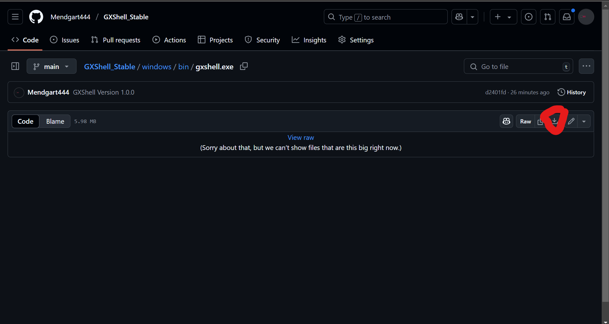

# GXShell: A Shell For Deveplopers!

#### The goal is to make an shell created for Devoplopers. The Shell comes with Features like:
- History: The Shell remembers the executet prompts (if it not works create an .history file in the user profile)
- GXCore: An Shell for changes in the BIOS/UEFI, GPU Fan speed (AMD Cards are not supported right now), And Displaying Fan speed and temp. sensores.

# How to install?
Step 1: Go to the executable data for your OS. (you find it in the folder with the OS name for example: windows or linux) <br>
Step 2: Click on the Executable and click:


# Syntax/Keywords Book
### change directory:

```sh
cd <path>
```
or home dir:

```sh
cd ~
```
### Show dirs and files in the current path:
```sh
dir
```
### Start GXCore

```sh
gxcore --start
```
### shows info of the Software:
```sh
info
```
### Shows the version of the Software:
```sh
version
```
#GXCore Keywords
### all bios options linux


```sh
bios --read-var

bios --set-var <name> <value>

bios --change-boot-order <new_order>

bios --show-temp-and-fans

bios --gpu-fan-speed

bios --create-partition <device> <start> <end>

bios --read-bios-info 
```

### windows

```sh
bios --read-var

bios --set-var <name> <value>

bios --change-boot-order <new_order>

bios --show-temp-and-fans

bios --gpu-fan-speed

bios --create-partition <disc_number> <size>

bios --read-bios-info 
```

### Other keywords Windows
```sh
set-ip-adress <interface> <ip> <gateway>

add-user <username> <password>
```
### Linux

```sh
set-ip-adress <interface> <ip>

add-user <username>
```
### Both 

```sh
sysinfo

kill-process
```

